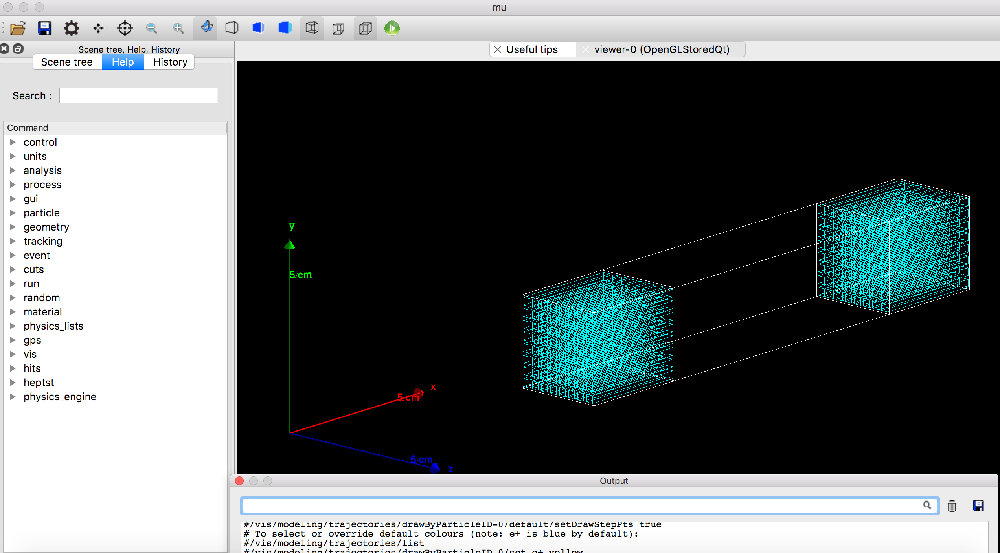

# README
Muography のための Geant4 example ソースファイル  
作成者：吉原
(2018.9.30 作成)

## 動作環境

- Mac OS High Sierra
- Geant4 10.04 (古いバージョンの Geant4 だと cmake が通らない可能性がある)
 
## 1. 必要ソフトウェアのインストール

#### ROOT 
以下のURLを参照して、インストールする。（ついでにPyROOTも使えるようにしておくと良い）
[http://osksn2.hep.sci.osaka-u.ac.jp/~taku/osx/install_root.html](http://osksn2.hep.sci.osaka-u.ac.jp/~taku/osx/install_root.html)

#### Geant4
以下のURLを参照して、インストールする。 
[https://qiita.com/takenawa/items/3158afc19aaaffd767c5](https://qiita.com/takenawa/items/3158afc19aaaffd767c5)
 
## 2. ソースファイルのビルド
まず、ソースファイルをダウンロードする。Terminal で下のコマンドを打つ。

```
$ git clone https://github.com/yoshihara-yuli/geant4-example_muon
```
上のコマンドでエラーが出た人は、brew で事前に git をインストールする。(```brew install git```)

次に、ダウンロードしたディレクトリに移動して、ビルド用ファイル(build/)を作成して、そこでソースファイルをcmake(gcmake)してから、ビルド(make)する。

```
$ cd geant4-example_muon-master
$ mkdir build
$ cd build
$ gcmake ../source
$ make -j4
```

gcmake は、Geant4 インストールの参考URLを元に設定する。
（あるいは、cmakeをしても良い。)

そうすると、実行ファイル ./mu が生成される。

実行ファイルを実行する前に、**bench/ に入っているマクロファイルを build/ 下にコピーしてくる。**

```
$ cp ../bench/* .
$ ./mu
```

これで、新しい画面（後述）が立ち上がればOK。


### 注意事項

- source/の中にあるファイルに変更を加えたら、必ず make -j4 をする(そうでなければ実行ファイルが更新されない)
- source/の中にあるファイルの削除やファイル名の変更、あるいは新規ファイルの追加を行なった場合は、build/ の中身をすべて削除したのち、再び cmake(gcmake)から行う。

## 3. シミュレーションの方法

### A: テストモード

ジオメトリ(検出器など)やソース(線源)の確認のために、GUI(Qt)を立ち上げてチェックする。

まず、ビルドによって生成された実行ファイルを実行する。

```
./mu
```
これで、下のような画面が表示される。 これで、定義したジオメトリを確認できる。
（図の青色がシンチレータ、白色が筐体を模擬したモジュール(今は空気)）




次に、GUIの下の方にある**Output**のコンソールで、実行用のマクロファイル(run.mac)を実行する。

```Outout
/control/execute run.mac
```
すると、ソースの定義も確認できる。

### B: バッチモード

ジオメトリなどが正しく定義してあれば、あとはシミュレーションをたくさん回すだけ。  
その時は、Terminal で実行用マクロファイルを以下のように実行する。

```
$ ./mu run.mac > /dev/null 2>&1
```

**\> /dev/null 2>&1** で、Terminal に本来表示されるべき文字をゴミ箱に移している（はず）。これにより、一般的な実行(```$ ./mu run.mac```)より早くシミュレーションが回せる。

## 3. 出力ファイル

build/ に、out.root として出力される。
解析には、ROOT が必要だが、PyROOTを使うと、ROOTファイルを読み込んで、Python でデータを解析できる。(まだ作ってない)


## 4. ジオメトリやソース(線源)の変更

[AboutCode.md](https://github.com/yoshihara-yuli/geant4-example_muon/source/Aboutcode.md) を参照。

## 2) ジオメトリの定義

ジオメトリとは、検出器やその他の周辺物体を物質や大きさ、配置などを定義している。

空気環境下において、EJ-200 のシンチレータ が 8x8 で配列されたアレイが、X軸方向に二つ並べて配置されている（下図）。


それぞれのアレイを**Scabox**と**Absbox**と定義しており、これらは1つのモジュール (**Module**)の中に入っている。

 Scabox と Abscox は、それぞれ 8x8 の EJ-200 シンチレータ (**voxel**) から構成されていて、**voxel**の大きさは、2x2x30mmである。
**voxel** は “sensitive detector”. にアサインされている。
(See Geant4 guidance documents)


## 3) ソースの定義

 
 ソース(線源)は、**GPS (General Particle Source)** を用いて定義する。  
 GPS の設定は、**bench/run.mac** (マクロファイル) で行う。
 
 GPS の参考になる資料は以下の二つ。
 
 - **[Using GPS (The General Particle Source)](http://nngroup.physics.sunysb.edu/captain/reference/master/detSim/dox/detSimGPS.html)**  
- **[Geant4 User Guide](ftp://ftp.iij.ad.jp/pub/linux/gentoo/distfiles/BookForAppliDev-4.10.2.pdf)**
 

## 4) Output Data
 The simulation results are output in **result.txt**.  
 (See **AboutCode.pdf** and the corresponding source files for more information.)


---

# README

Created on Sep.27th, 2018.

# Reference
[Geant4 Training at Desy Zeuthen, 2011/3 (Geant4 and Calorimetry in HEP)](https://www-zeuthen.desy.de/geant4/g4course2011/day1/overview.html) > [Day 2 Basics of Geant4](https://www-zeuthen.desy.de/geant4/g4course2011/day2/index.html) > [Proxesses and Particles](https://www-zeuthen.desy.de/geant4/g4course2011/day2/4_particlesNprocesses/index.html)


# General Particle Source 
- Good examples for use of GPS: **[Using GPS (The General Particle Source)](http://nngroup.physics.sunysb.edu/captain/reference/master/detSim/dox/detSimGPS.html)**
- Detail explanation for GPS: **[Geant4 User Guide](ftp://ftp.iij.ad.jp/pub/linux/gentoo/distfiles/BookForAppliDev-4.10.2.pdf)**

# How to get source files?
```
wget http://www.ifh.de/geant4/g4course2011/day2d.tgz
```

# How changed?

- Geometry -> copy number:0-127 "Sensor", EJ-200
- Muon beam

## EJ-200/EJ-212
Plastic scintillators such as EJ-200 often seems to be supposed as 'PVT bases'.  
(ref: [murffer/DetectorSim/blob/master/ScintillationSlab/src/Material.cc](https://github.com/murffer/DetectorSim/blob/master/ScintillationSlab/src/Material.cc))  
Thus, EJ-200 is defined as **G4\_PLASTIC\_SC\_VINYLTOLUENE** in this code.

```
EJ200 = nistMan->FindOrBuildMaterial("G4_PLASTIC_SC_VINYLTOLUENE");

```  
  
G4\_PLASTIC\_SC\_VINYLTOLUENE is defined at 1468-1470 Lines in **G4NistMaterialBuilder.cc**.  
(ref: [Id: G4NistMaterialBuilder.cc 67044 2013-01-30 08:50:06Z gcosmo](http://www.apc.univ-paris7.fr/~franco/g4doxy/html/G4NistMaterialBuilder_8cc-source.html))

```G4NistMaterialBuilder.cc
AddMaterial("G4_PLASTIC_SC_VINYLTOLUENE", 1.032, 0, 64.7, 2);
AddElementByWeightFraction( 1, 0.085);
AddElementByWeightFraction( 6, 0.915);
```

Since EJ-200 and EJ-212 have similar properties, EJ-212 can be also defined as G4\_PLASTIC\_SC\_VINYLTOLUENE.

# Schedule
- Add muon libraries to PhysicsList 9/27
- Generate muon beam 9/27
- Change detector geometry 9/28
- Change detector materials 9/28
- remove unnecessary definitions 9/29
- change file name 9/29